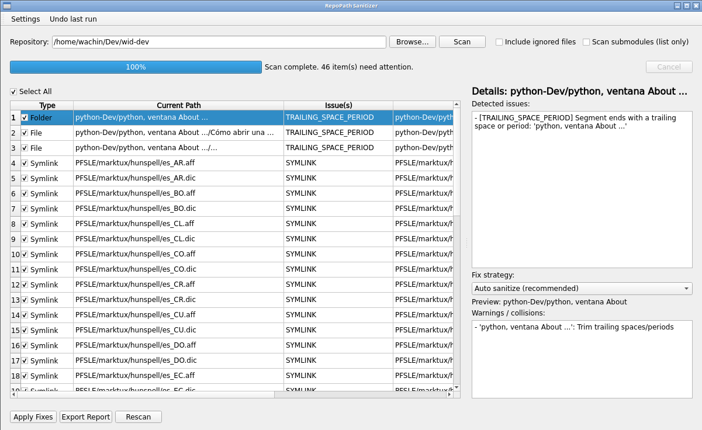
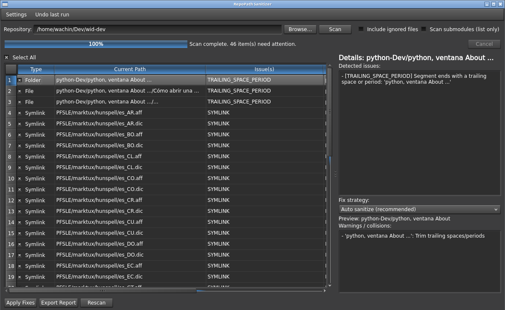

# RepoPath Sanitizer

A PyQt6 desktop app (Linux-first) that scans a local Git working tree and finds file/folder paths
that would fail to check out on Windows. It proposes safe fixes and can apply them using **git-aware renames**
(`git mv`) to preserve history.


---

## Features

- Detects Windows-incompatible paths in Git repositories
- Git-aware renames (`git mv`) to preserve history
- Collision detection (case-insensitive + Unicode NFC)
- Long path detection and shortening strategies
- GUI + CLI modes
- Safe undo system

---

## Screenshots

### Main Window (Light Theme)



### Main Window (Dark Theme)



---

## Runtime Requirements

RepoPath Sanitizer requires:

- Python 3.10+
- Git (used for safe `git mv` operations)
- PyQt6

Install on Debian:

```bash
sudo apt install python3 python3-venv python3-pyqt6 git
```

This program was tested on **Debian 12 (Bookworm)**.

---

## PyQt6 on Debian (VERY IMPORTANT)

On Debian, installing **PyQt6 via pip** may fail because it tries to build from source and requires a full Qt development environment.

For this reason, on Debian it is recommended to use **the system PyQt6 package (APT)** together with a virtual environment that can access system packages.

### Recommended method on Debian

```bash
sudo apt update
sudo apt install python3 python3-venv python3-pyqt6 git

python3 -m venv .venv --system-site-packages
source .venv/bin/activate

pip install -U pip
pip install -e .[dev] --no-deps

repopath-sanitizer
```

`--system-site-packages` allows the virtual environment to use PyQt6 installed via APT.  
`--no-deps` prevents pip from trying to reinstall PyQt6 from PyPI.

---

## CLI Mode

```bash
repopath-sanitizer --cli --repo /path/to/repo --json out.json --text out.txt
```

---

## Safety Notice

This tool performs Git renames (`git mv`).  
Always review changes with:

```bash
git status
git diff
```

before committing.

---

## How It Works

The scanner:

1. Uses `git ls-files` to enumerate repository paths
2. Validates each path against Windows filesystem rules
3. Detects:
   - forbidden characters
   - reserved device names
   - trailing spaces/periods
   - path length issues
   - case-insensitive collisions
   - Unicode normalization conflicts
4. Proposes safe sanitized paths
5. Applies fixes using `git mv` to preserve history

---

## Developer Requirements

For development and testing:

```bash
sudo apt install python3-pytest
```

---

## Project Structure (for developers)

```
src/repopath_sanitizer/
    ui_main.py        # GUI
    engine.py         # Scan logic
    pathrules.py      # Windows compatibility rules
    gitutils.py       # Git operations
    worker.py         # Background tasks
    report.py         # JSON/Text reports
    state.py          # Undo system
    cli.py            # CLI mode
```

---

## Debian Packaging Dependencies

To build the `.deb` package you need:

```bash
sudo apt install debhelper dh-python python3-all pybuild-plugin-pyproject \
    python3-pyqt6 python3-pytest git
```

Then build with:

```bash
sudo apt build-dep .
dpkg-buildpackage -us -uc
```

---

## Translations (Qt Linguist / Qt Creator)

The application is prepared for internationalization.

Install tools:

```bash
sudo apt install qtcreator qttools5-dev-tools qt6-tools-dev-tools
```

Workflow to add a language:

```bash
pylupdate6 src -ts translations/repopath_sanitizer_es.ts
linguist translations/repopath_sanitizer_es.ts
lrelease translations/repopath_sanitizer_es.ts
```

Translation files (`.qm`) are installed to:

```
/usr/share/repopath-sanitizer/translations/
```
