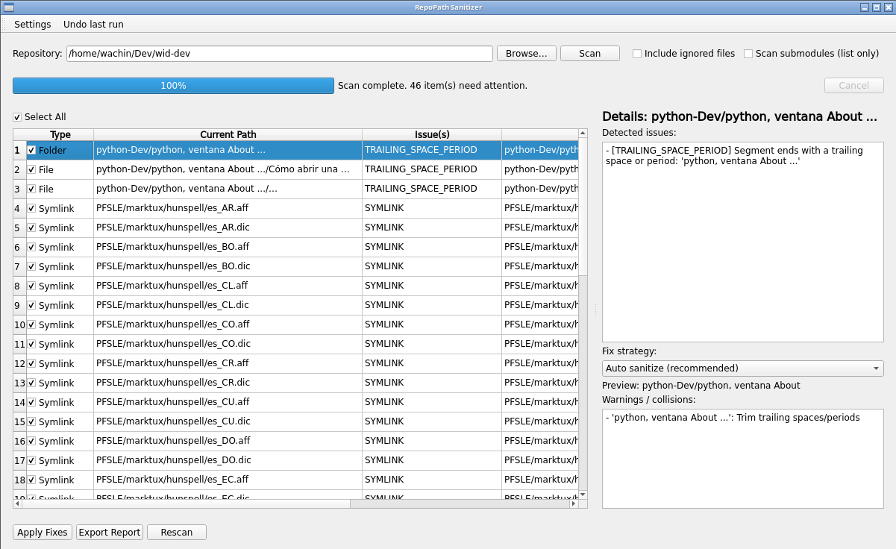
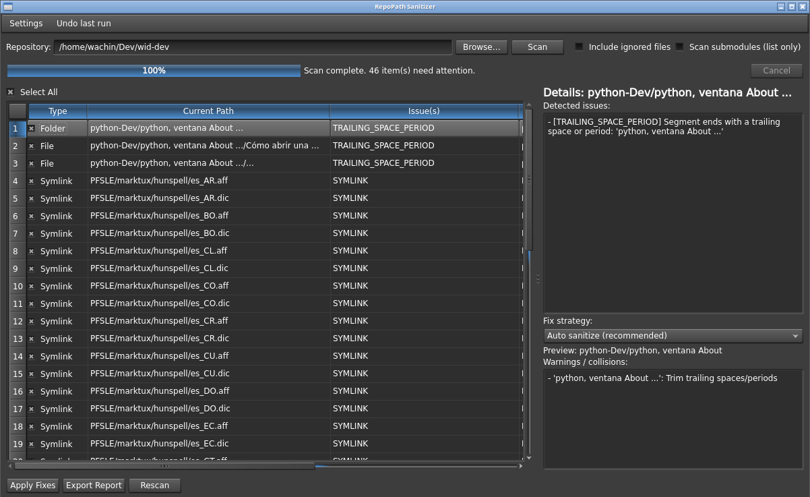

En Linux puedes probar el programa directamente con: `python3 -m repopath_sanitizer`

# RepoPath Sanitizer

A PyQt6 desktop app (Linux-first) that scans a local Git working tree and finds file/folder paths
that would fail to check out on Windows. It proposes safe fixes and can apply them using **git-aware renames**
(`git mv`) to preserve history.


---

## Features

- Detects Windows-incompatible paths in Git repositories
- Reports tracked files and normal untracked files; ignored files are optional
- Git-aware renames (`git mv`) to preserve history
- Collision detection (case-insensitive + Unicode NFC)
- Long path and long file/folder name detection with shortening strategies
- Estimated Windows checkout path detection using a configurable base folder
- GUI + CLI modes
- Safe undo system
- Results context menu for opening paths in the file manager or copying paths

## Fixed Case: Windows Clone Failure Caused by Trailing Periods

This project now documents and tests an important real-world case that breaks `git clone` or `git checkout` on Windows:

- Problematic path example: `Promts/Acerca de.../About Juan y Washington.txt`

The problem was not the file `About Juan y Washington.txt` itself. The real issue was the directory name `Acerca de...`, because Windows does not allow file or folder names to end with a period (`.`) or a space.

On Linux, Git can store and check out that path without trouble. On Windows, the clone may download successfully but fail during checkout with an error similar to:

```text
error: invalid path 'Promts/Acerca de.../About Juan y Washington.txt'
fatal: unable to checkout working tree
```

RepoPath Sanitizer already had the trailing-space/trailing-period rule, and this case is now explicitly covered in tests and documentation so it remains protected against regressions.

The automatic fix is to trim the invalid trailing periods from the affected segment:

- Original: `Promts/Acerca de.../About Juan y Washington.txt`
- Fixed: `Promts/Acerca de/About Juan y Washington.txt`

---

## Screenshots

### Main Window (Light Theme)



### Main Window (Dark Theme)



---

## Runtime Requirements

RepoPath Sanitizer requires:

- Python 3.10+
- Git (used for safe `git mv` operations)
- PyQt6

Install on Debian 12:

```bash
sudo apt install python3 python3-pyqt6 git
```

This program was tested on **Debian 12 (Bookworm)**.

---

## PyQt6 on Debian (VERY IMPORTANT)

On Debian, installing **PyQt6 via pip** may fail because it tries to build from source and requires a full Qt development environment.

For this reason, on Debian it is recommended to use **the system PyQt6 package (APT)**. Using `pip` and a virtual environment is optional; if your dependencies are already installed from the Debian 12 repositories, you can test the program directly without creating a `venv`:

```bash
python3 -m repopath_sanitizer
```

### Optional editable install with pip

```bash
sudo apt update
sudo apt install python3 python3-venv python3-pyqt6 git

python3 -m venv .venv --system-site-packages
source .venv/bin/activate

pip install -U pip
pip install -e .[dev] --no-deps

repopath-sanitizer
```

`--system-site-packages` allows the virtual environment to use PyQt6 installed via APT.  
`--no-deps` prevents pip from trying to reinstall PyQt6 from PyPI.


The second time you want to launch the program, just put:

```bash
source .venv/bin/activate
repopath-sanitizer
```

---

## CLI Mode

```bash
repopath-sanitizer --cli --repo /path/to/repo --json out.json --text out.txt
```

---

## Safety Notice

This tool performs Git renames (`git mv`).  
Always review changes with:

```bash
git status
git diff
```

before committing.

---

## How It Works

The scanner:

1. Uses `git ls-files` to enumerate tracked files and normal untracked files
2. Validates each path against Windows filesystem rules
3. Detects:
   - forbidden characters
   - reserved device names
   - trailing spaces/periods
   - total path length issues
   - individual file/folder name length issues
   - case-insensitive collisions
   - Unicode normalization conflicts
4. Proposes safe sanitized paths
5. Applies fixes using `git mv` to preserve history

For the Windows checkout failure described above, the relevant rule is `trailing spaces/periods`. If a path segment ends in `.` or space, the sanitizer flags it and proposes a trimmed replacement that Windows can store safely.

The scanner also detects repositories that may fail on Windows because the final checkout path becomes too long after combining:

- the Windows base folder
- the repository folder name
- deep nesting of folders and subfolders
- long file or folder names

This matters because a repository may look acceptable on Linux while still failing on Windows when cloned under a path such as `C:\Users\Name\Documents\Projects\...`.

---

## Developer Requirements

For development and testing:

```bash
sudo apt install python3-pytest
```

---

## Project Structure (for developers)

```
src/repopath_sanitizer/
    ui_main.py        # GUI
    engine.py         # Scan logic
    pathrules.py      # Windows compatibility rules
    gitutils.py       # Git operations
    worker.py         # Background tasks
    report.py         # JSON/Text reports
    state.py          # Undo system
    cli.py            # CLI mode
```

---

## Debian Packaging Dependencies

To build the `.deb` package you need:

```bash
sudo apt install debhelper dh-python python3-all pybuild-plugin-pyproject \
    python3-pyqt6 python3-pytest git
```

Then build with:

```bash
sudo apt build-dep .
dpkg-buildpackage -us -uc
```

---

## Translations (Qt Linguist / Qt Creator)

The application is prepared for internationalization.

Install tools:

```bash
sudo apt install qtcreator qttools5-dev-tools qt6-tools-dev-tools
```

Workflow to add a language:

```bash
pylupdate6 src -ts translations/repopath_sanitizer_es.ts
linguist translations/repopath_sanitizer_es.ts
lrelease translations/repopath_sanitizer_es.ts
```

Translation files (`.qm`) are installed to:

```
/usr/share/repopath-sanitizer/translations/
```
